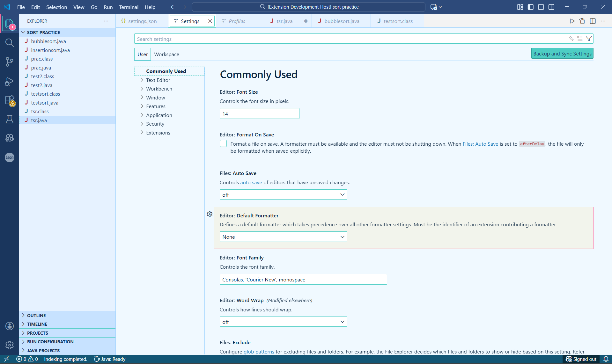

#VS blue Theme
## Features

- **Error & Warning Visibility**: Clearly marked problems with colored borders
- **Terminal Integration**: Matching terminal colors for consistency
- **Git Integration**: Clear status indicators for version control



## Installation

1. Open **Extensions** sidebar panel in VS Code (`Ctrl+Shift+X` or `Cmd+Shift+X`)
2. Search for `VS Blue Theme`
3. Click **Install**
4. Open the Command Palette with `Ctrl+Shift+P` or `Cmd+Shift+P`
5. Type `Preferences: Color Theme` and select **SkyBlue Theme**

## Recommended Settings

For the best experience, add these to your settings.json:

```json
{
    "editor.fontFamily": "'Cascadia Code', 'JetBrains Mono', Consolas, monospace",
    "editor.fontSize": 14,
    "editor.lineHeight": 1.6,
    "editor.renderWhitespace": "boundary",
    "editor.matchBrackets": "always",
    "editor.bracketPairColorization.enabled": true,
    "workbench.iconTheme": "material-icon-theme",
    "workbench.editor.enablePreview": false,
    "problems.showCurrentInStatus": true
}